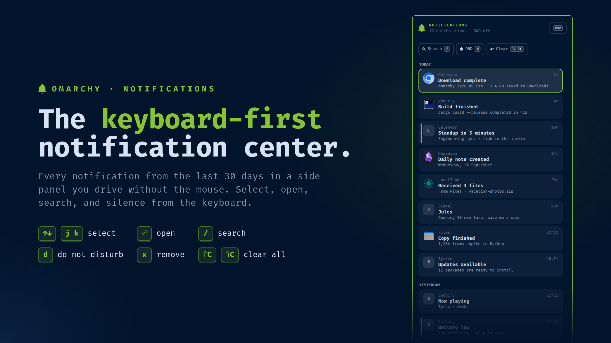

# Notifications

**The keyboard-first notification center for Omarchy.**



A bell on the Omarchy bar that opens a full-height side panel of your
notifications, against the right edge of the screen. You can do everything in
the panel from the keyboard: move with the arrows or `j`/`k`, open with Enter,
search with `/`, and toggle Do Not Disturb with `d`, without reaching for the
mouse. History goes back 30 days rather than Omarchy's last 10.

## Install

```bash
omarchy plugin add https://github.com/jgarza9788/notification.git --enable
```

`--enable` puts the bell on the right side of the bar.

### Requirements

`jq`, `inotify-tools`, `file` and `util-linux` (for `flock`). All four are part
of Omarchy's base install. Without `inotifywait`, new notifications still show
up, but only every 30 seconds.

### Remove

```bash
omarchy plugin remove jgarza.notification
rm -rf ~/.local/state/jgarza-notification   # optional: delete the archived history
```

Removing the plugin leaves Omarchy's own notifications and settings as they
were. The second command deletes the history this plugin kept.

## Keys

| Key | |
|---|---|
| `↑` `↓` / `k` `j` | select (wraps around) |
| `PgUp` `PgDn`, `Home`/`g`, `End`/`G` | jump |
| `Enter` / `Space` | open the selected notification ("click" it) |
| `/` | search; type to filter, `Enter` keeps the filter, `Esc` clears it |
| `d` | toggle Do Not Disturb |
| `Shift+C` `Shift+C` | clear everything (the first press asks, the second clears) |
| `x` / `Delete` | remove the selected notification |
| `Esc` | clear the search, or close the panel |
| `Tab` | next bar panel |

On the bar, left-click opens the panel and right-click toggles Do Not Disturb.
The bell changes to a crossed-out bell while DND is on, and a badge counts
what's new since you last opened the panel.

### What "open" does

1. **Still on screen as a toast**: runs the toast's own action, the same as
   clicking the toast.
2. **Pointed at a picture** (screenshots, camera): opens the picture.
3. **Otherwise**: focuses the app that sent it.

The panel never re-runs a command stored with an old notification, because
any program can send one.

## Open it from a key

```bash
omarchy-shell jgarza.notification toggle
```

For example, in `~/.config/hypr/bindings.lua`:

```lua
o.bind("SUPER + N", "Notifications", "omarchy-shell jgarza.notification toggle")
```

## History

Omarchy's notification service keeps only the last 10 notifications.
`bin/notification-store` copies each one as it arrives into
`~/.local/state/jgarza-notification/` (mode `0700`), icons included. It keeps
them for `keepDays` days, up to a limit of `maxItems`. Clearing the panel also
clears Omarchy's own history.

```
bin/notification-store list 50 | jq -r '.[] | "\(.app): \(.summary)"'
```

### Privacy

The archive keeps the full text of every notification, plus copies of its
icon and picture, for `keepDays` days. That includes anything sensitive a
notification carries, such as message previews or one-time login codes, and
it stays there after Omarchy itself has forgotten them. Clearing from
Omarchy's own notification UI does not touch the archive. To get rid of
entries, press `x` on one, or `Shift+C` twice to clear everything. You can
also lower `keepDays`. The files are readable only by you.

## Settings

| Setting | Default | |
|---|---|---|
| `panelWidth` | 420 | panel width |
| `keepDays` | 30 | days to keep |
| `maxItems` | 500 | most to keep |
| `badge` | Count | `Count`, `Dot` or `None` |
| `showBody` | true | show message text |
| `animationMs` | 240 | slide-in duration; 0 turns it off |
| `iconScale` | 140 | bell size on the bar, % of a normal bar icon |
| `icon` / `iconDnd` | bell / bell-off | bar glyphs |

## Tests

```bash
node tests/model.test.js
bash tests/store.test.sh
```

The running panel can be driven over IPC, since synthetic key presses don't
reach the shell. That IPC can add fake entries and press keys, so it is off
unless a flag file exists when the shell starts:

```bash
touch ~/.local/state/jgarza-notification/test-ipc && omarchy-restart-shell
omarchy-shell jgarza.notification.test seed 20
omarchy-shell jgarza.notification.test key down      # up enter search dnd clear remove escape
omarchy-shell jgarza.notification.test state
```
